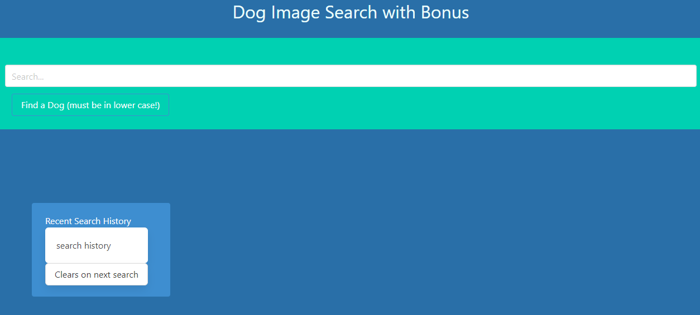

# dogs-dogs-dogs

## Description

A website where you can "fetch" pictures of those lovely puppers and catch up on some news articles.  It might be worth it to take a peek at the news article before enjoying the pictures though....some of them are "ruff".

## Languages Used

- HTML
- CSS
- javascript
- Bulma
- dog.ceo API
- daily-dog-news API

## Usage

[github Repo](https://github.com/TaylorStrubhar/dogs-dogs-dogs)

[Deployed page](https://taylorstrubhar.github.io/dogs-dogs-dogs/)

To use this site, simply navigate to the webpage and type in the breed of a dog you would like to see.  We will track your search history so you can easily look back at some of your favorites.  

## License

[MIT license](./LICENSE)
